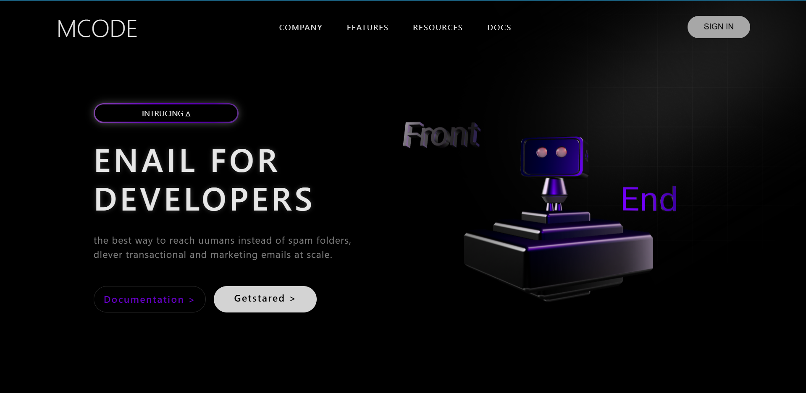

# ⚙️ MCODE — 3D Landing Page for Developers

A futuristic landing page concept featuring a **3D Spline robot** that reacts to cursor movement.  
Designed with a sleek dark interface and glowing purple accents — merging web design, motion, and creativity for developers.



---

## 🪄 Highlights
- **3D interactive robot** built and embedded using [Spline](https://spline.design)
- **Head-tracking motion** that follows the user’s cursor  
- **Dark mode aesthetic** with neon gradients and smooth depth shadows  
- **Responsive landing page layout** (HTML, CSS, JS)  
- Minimal top navigation, call-to-action buttons, and animated text effects  

---

## 🧰 Tech Stack
- **HTML5** — page structure  
- **CSS3** — layout, gradients, and hover animations  
- **JavaScript** — cursor tracking and interactions  
- **Spline** — embedded 3D character model

---

## 🧠 Concept
> “A landing page that doesn’t just look alive — it *feels* alive.”

MCODE represents the connection between developers and creativity.  
The robot symbolizes innovation and curiosity — following your movements as you explore the site.

---

## 🧩 Setup
Clone this repository and open `index.html` in your browser:

```bash
git clone https://github.com/yourusername/mcode-3d-landing.git
cd mcode-3d-landing
